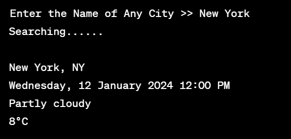

# Weather Information Fetcher

This simple Python script fetches current weather information for a given city using web scraping. It utilizes BeautifulSoup for HTML parsing and requests for making HTTP requests.

## Installation

1. Clone the repository:

    ```bash
    git clone https://github.com/Elmoumen202a/Python-Projects.git
    cd Live_weather_updates
    ```

2. Install the required dependencies:

    ```bash
    pip install -r requirements.txt
    ```

## Usage

Run the script by executing the following command:

```bash
python weather.py

## Output

